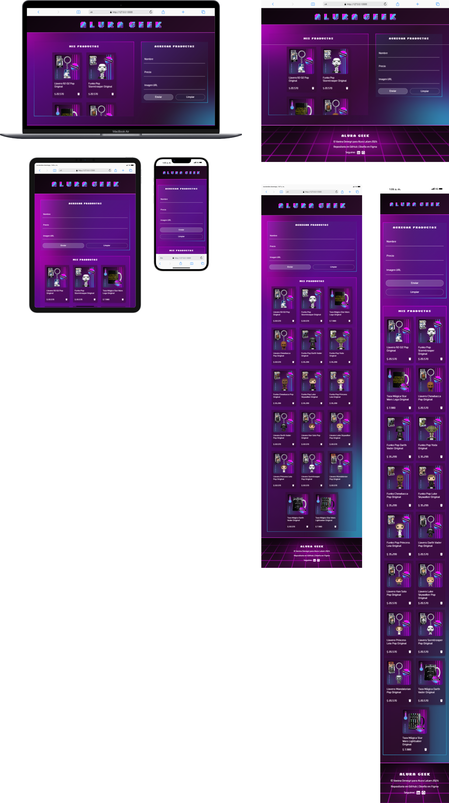

<h1>ALURA GEEK :purple_heart::purple_heart::purple_heart:</h1>

<p align="center"></p>

<h2>Estado :battery:</h2>
<p align="left"></p>

<h2>Tecnologías :computer:</h2>
<p align="left">
    
<br>
<br>
   
</p>

<h2>Descripción del Proyecto :bulb:</h2>
<p>
Alura Geek es una aplicación web para gestionar productos en una página ecommerce, permitiendo a los usuarios visualizar, agregar nuevos artículos a partir de un formulario y eliminarlos de ser necesario.
<br>
<br>
El proyecto surge como solución al Challenge de Formación en Front End de Alura Latam + Oracle. Además de trabajar con tecnologías FrontEnd, parte del desafío fue el desarrollo en JavaScript y la creación de un servidor JSON simulado.
</b>

<h2>Requisitos :clipboard:</h2>

<h3>Requisitos del Challenge :ok_hand:</h3>
<p>
:heavy_check_mark: diseño responsivo.
<br>:heavy_check_mark: sección donde se mostrarán los productos.
<br>:heavy_check_mark: formulario de carga.
<br>:heavy_check_mark: creación de una API RESTful simulada con json-server.
<br>:heavy_check_mark: funcionalidad de renderizar productos (GET).
<br>:heavy_check_mark: funcionalidad de crear productos nuevos (POST).
<br>:heavy_check_mark: duncionalidad de eliminar un producto (DELETE).
<br>:heavy_check_mark: control de fallas.
</p>

<h3>Puntos de mejora :muscle:</h3>
<p>
Cosas que quiero agregar en el futuro:
<br>:small_orange_diamond: funcionalidad de búsqueda.
<br>:small_orange_diamond: alertas y mensajes de error personalizados.
<br>:small_orange_diamond: conectar con una API en línea.
</p>

<h3>Instalación :wrench:</h3>
<p>
:rotating_light: Requisito previo: tener instalado Nodle.js.
<br>:one: Clonar este repositorio.
<br>:two: Abrir el proyecto en Visual Studio Code.
<br>:three: Conectar con el servidor JSON:
</p>

```bash
npm install json-server
```

```bash
npx json-server --watch database.json --port3000
```
<p>
:four: Abrir el index.html en el navegador.
<br>:arrow_right: <a href="https://postimg.cc/gallery/WzDfF6H">Aguí</a> se encuentra una galería de imágenes que puedes usar para probar este Alura Geek </p>

<h2>Acceso al proyecto :link:</h2>
<p>
<br>
<a href="https://github.com/VannDennOk/alura_geek.git"></a>
 <a href="https://vd-alura-geek.netlify.app/"></a>
 <a href="https://www.figma.com/design/b5smkFNGl1FnWfQ6vbrJ4J/AluraGeek-by-Vanina-Denegri?node-id=18416-1442&t=UIUQNPUYuUVxBTdF-1"></a>
</p>

<h2>Autoría :woman:</h2>
<p>
Esta página fue diseñada y desarrollada por Vanina Denegri.
<br>
<br>
<a href="https://github.com/VannDennOk"></a> <a href="https://www.linkedin.com/in/vaninadenegri/"></a>
</p>

<h2>Reconocimientos :crown:</h2>
<p>
Herramientas web utilizadas en este README:
<br>
<br>
<a href="https://shields.io/"></a> 
<a href="https://simpleicons.org/"></a>
<a href="https://gist.github.com/rxaviers/7360908"></a> 
</p>

<h2>Muestrame tu apoyo :gift_heart:</h2>
<p>
:star: Si te gustó mi proyecto podés dejarme alguna estrellita.
<br>:e-mail: Mandarme algún mensaje.
<br>:bell: Seguirme en redes para comentar y compartir.
<br>:gift_heart: Darme los reconocimientos correspondientes si es necesario.
</p>

<h2>Notas finales :exclamation:</h2>
<p>Estos son mis primeros proyectos. Aún me quedan muchas cosas por aprender y mejorar. Si tenés algún comentario para ayudarme a crecer lo recibiré atentamente, siempre y cuando venga con respeto.</p>

<h2>Licencia :warning:</h2>
<a href="https://opensource.org/license/MIT"></a></p>